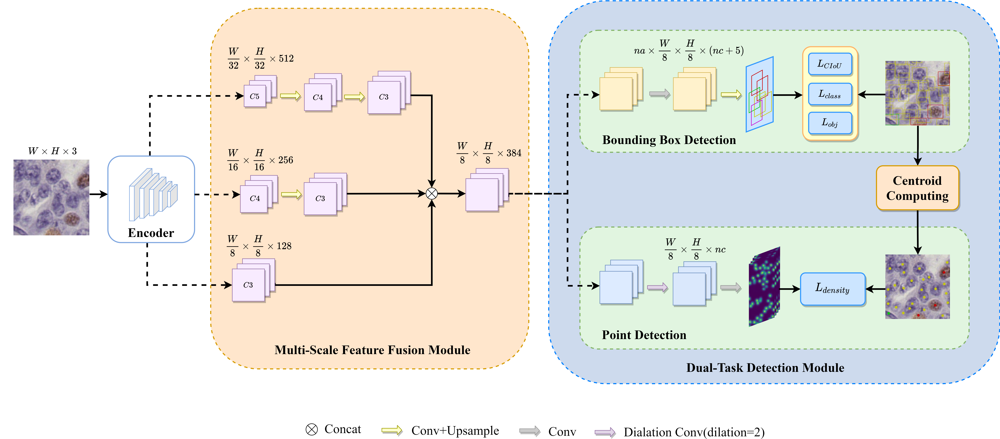
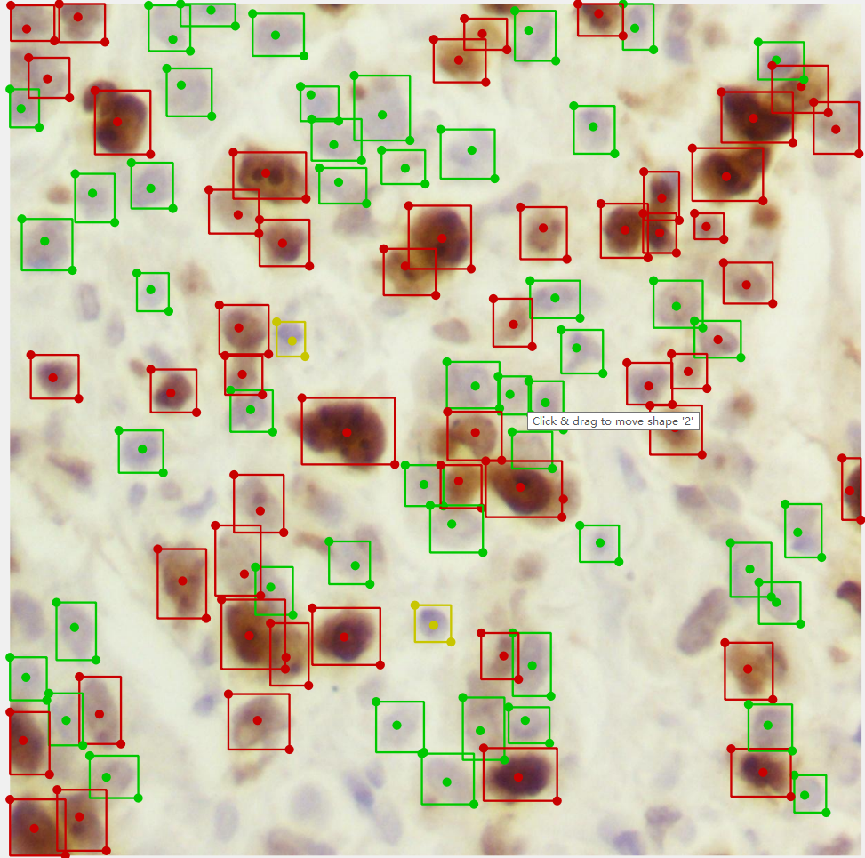

## CellDet: Dual-Task Cell Detection Network for IHC-Stained Image Analysis
article have been received by BIBM 2021

### SHIDC_B_KI67_bbox 
```
dataset download: 
https://pan.baidu.com/s/1g2a38fmUzNDBAjxZHMAXyw  y9nz 
```

#### Network Structure
</img>

#### Image
</img>


